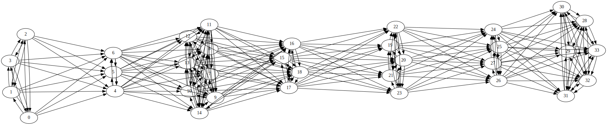

# Spiking Neural Network in Rust
Questo progetto consente di simulare il comportamento di una spiking neural network in rust.
Il crate consente di istanziare una SNN basata sul modello Leaky integrate and fire di dimensioni variabili e fornirgli degli input sotto forma di impulsi. 

Il progetto é stato sviluppato per il corso Programmazione di 
Sistema 02GRSOV da:

Tilocca Salvatore - s305938
 
Dellisanti Christian - s306027
  
Carlucci Francesco - s304910

## Indice
 - lib.rs
   - mod NeuralNetwork : modello della rete, espone le funzioni per istanziarla:
        - new : crea la rete a partire da un vettore di neuroni già istanziati e due vettori per i pesi delle sinapsi.
        - new_from_arr : crea la rete dato il vettore delle sue dimensioni, il numero di neuroni per ogni layer, inizializzando i parametri dei neuroni in modo randomico.
        - new_from_file : crea la rete leggendo il file di un modello preallenato
        - start_simulation : accetta come parametro di ingresso il vettore di impulsi mandati nel primo livello, esso farà partire una simulazione in cui ogni neurone           farà prima un check per controllare se ha superato la soglia, in caso affermativo manderà impulsi ai suoi vicini in modo parallelo, i neuroni sono                       sincronizzati grazie alla barriera del countdown latch 
    - mod Impulse : composto da valore dell'impulso e tempo
    - mod cdl: countdown latch, implementa una barriera per i thread di tutti i neuroni
 - lib_neuron : modello del singolo neurone, con funzioni per crearlo, modificarlo e inviargli impulsi in modo parallelo
 - inoltre si è fatto uso delle librerie esterne quali: __graphviz__ per la stampa della rete neurale, __petgraph__ per avere lo schelettro della rete neurale,e infine __rand__ per la generazione di numeri randomici 

## Esempio
Riportiamo un breve esempio di utilizzo del crate:
### Creazione rete

    use libSpikingNeuralNetwork::lib_neuron::{Neuron};
    use libSpikingNeuralNetwork::NeuralNetwork::NeuralNetwork;

    fn main() {
        use rand::Rng;
        let mut rng = rand::thread_rng();

vettore dei pesi delle sinapsi tra nodi dello stesso layer

        let mut weight_same_level=Vec::new();

vettore delle sinapsi tra un layer e il successivo

        let mut weight_next_level=Vec::new();

popoliamo i vettori con valori noti o casuali

        for _ in 0..148{weight_same_level.push(rng.gen_range(-4.0 .. 0.0))}
        for _ in 0..236{weight_next_level.push(rng.gen_range(0.0 .. 4.0))}

creiamo la rete, fornendo il vettore delle sue dimensioni es: [4, 3, 12, 4, 5, 4, 6]

        let rete = NeuralNetwork::new_from_arr(&[4, 3, 8, 4, 5, 4, 6], weight_same_level,weight_next_level);

visualizziamo la rete

        println!("{:?}",rete);
    }

Come risultato otteniamo la rappresentazione del grafo in linguaggio dot e la relativa immagine generata con graphviz:

### Configurazione neuroni
Un singolo neurone può essere creato fornendo alla funzione new un identificativo, i parametri dei potenziali di reset, di riposo e di soglia e il numero del suo layer. I parametri del neurone sono tipi generici. Il potenziale di mebrana viene inizializzato uguale al potenziale di riposo. Il neurone ha due campi interni, t_old, l'istante in cui ha ricevuto l'ultimo impulso e impulse_in, la somma pesata degli impulsi in ingresso in ogni istante.
struct neurone:

    pub struct Neuron {
        pub Nid: u32,
        pub potential_reset: f64,
        pub potential_sleep: f64,
        pub threshold: f64,
        pub potential_membrane: f64,
        pub t_old: Instant,
        pub layer: usize,
        pub impulse_in: f64,
    }
creazione:

    let n = Neuron::new(0,0,1,1,0);
    assert_eq!(n.Nid,0);
    assert_eq!(n.potential_reset,0.);
    assert_eq!(n.potential_sleep,1.);
    assert_eq!(n.threshold,1.);
    assert_eq!(n.layer,0);

Si può inviare un impulso a un neurone attraverso la sua funzione check_neurone, la funzione implementa il meccanismo Leaky Integrate and Fire e restituisce true se il neurone ha superato la soglia e quindi emette una spike, false altrimenti.

    use rand::Rng;
    let mut rng = rand::thread_rng();
    let mut n = Neuron::new(0,0.,1.,0.8,0);
    let mut impulse_in = Vec::new();
    for _ in 1..= 7 {
        impulse_in.push(rng.gen_range(0 ..= 1)); //vettore casuale di 1 o 0
    }
    println!("{:?}",impulse_in);

input: [1, 1, 1, 0, 1, 0, 0]

    let mut spike_out=Vec::new();
    for i in 0..7 {
         std::thread::sleep(Duration::new(0.4 as u64, 0));
         spike_out.push(n.check_neurone(impulse_in.clone(), i));
    }
    println!("{:?}",spike_out);

output: [true, false, false, false, false, false, false]

L'impulso emesso viene propagato usando la funzione send_impulse che riceve un vettore dei vicini del neurone, i neuroni a cui é connesso.

### Simulazione
Possiamo simulare il comportamento della rete:

Creiamo il vettore degli impulsi in input, di dimensione pari al numero di neuroni del primo layer per il numero di istanti della simulazione.

    let mut impulse_in = Vec::new();
    for _ in 1..=4 * 7 {
        impulse_in.push(rng.gen_range(0 ..= 1)); //vettore casuale di 1 o 0
    }

lanciamo la simulazione:

    let ImpulseOut = rete.clone().start_simulation(impulse_in);
    println!("output: {:?}", ImpulseOut);

Durante la simulazione si possono monitorare gli stati dei neuroni attraverso una serie di log che la rete stampa a video.
Riportiamo un esempio con una rete di dimensioni [4, 4, 4, 4, 4], si possono vedere ad ogni istante come tutti i neuroni
siano sincronizzati dalla barriera e quali livelli vengono poi attivati per propagare i propri impulsi:

    tid: 0 livello;0
    tid: 1 livello;0
    tid: 2 livello;0
    tid: 3 livello;0
    ho attivato il livello:1
    tid: 4 livello;1
    tid: 7 livello;1
    tid: 6 livello;1
    tid: 5 livello;1
    ho attivato il livello:0
    ho attivato il livello:2
    tid: 11 livello;2
    tid: 0 livello;0
    tid: 8 livello;2
    tid: 9 livello;2
    tid: 2 livello;0
    tid: 10 livello;2
    tid: 3 livello;0
    tid: 1 livello;0
    ho attivato il livello:1
    ho attivato il livello:3
    tid: 6 livello;1
    tid: 5 livello;1
    tid: 4 livello;1
    tid: 7 livello;1
    tid: 13 livello;3
    tid: 12 livello;3
    tid: 14 livello;3
    tid: 15 livello;3
    ho attivato il livello:0
    ho attivato il livello:2
    ho attivato il livello:4
    tid: 17 livello;4
    tid: 16 livello;4
    tid: 18 livello;4
    tid: 8 livello;2
    tid: 2 livello;0
    tid: 11 livello;2
    tid: 1 livello;0
    tid: 19 livello;4
    tid: 3 livello;0
    tid: 0 livello;0
    tid: 10 livello;2
    tid: 9 livello;2
    ho attivato il livello:1
    ho attivato il livello:3
    tid: 6 livello;1
    tid: 5 livello;1
    tid: 13 livello;3
    tid: 4 livello;1
    tid: 14 livello;3
    tid: 7 livello;1
    tid: 12 livello;3
    tid: 15 livello;3
    ho attivato il livello:0
    ho attivato il livello:2
    ho attivato il livello:4
    tid: 17 livello;4
    tid: 1 livello;0
    tid: 2 livello;0
    tid: 3 livello;0
    tid: 18 livello;4
    tid: 9 livello;2
    tid: 19 livello;4
    tid: 10 livello;2
    tid: 8 livello;2
    tid: 0 livello;0
    tid: 16 livello;4
    tid: 11 livello;2
    ho attivato il livello:1
    ho attivato il livello:3
    tid: 15 livello;3
    tid: 5 livello;1
    tid: 7 livello;1
    tid: 12 livello;3
    tid: 14 livello;3
    tid: 13 livello;3
    tid: 4 livello;1
    tid: 6 livello;1
    ho attivato il livello:0
    ho attivato il livello:2
    ho attivato il livello:4
    tid: 11 livello;2
    tid: 16 livello;4
    tid: 19 livello;4
    tid: 9 livello;2
    tid: 18 livello;4
    tid: 0 livello;0
    tid: 17 livello;4
    tid: 3 livello;0
    tid: 8 livello;2
    tid: 2 livello;0
    tid: 10 livello;2
    tid: 1 livello;0
    ho attivato il livello:1
    ho attivato il livello:3
    tid: 12 livello;3
    tid: 7 livello;1
    tid: 5 livello;1
    tid: 6 livello;1
    tid: 4 livello;1
    tid: 15 livello;3
    tid: 13 livello;3
    tid: 14 livello;3
    ho attivato il livello:2
    ho attivato il livello:4
    tid: 19 livello;4
    tid: 16 livello;4
    tid: 8 livello;2
    tid: 10 livello;2
    tid: 18 livello;4
    tid: 17 livello;4
    tid: 11 livello;2
    tid: 9 livello;2
    ho attivato il livello:3
    tid: 12 livello;3
    tid: 13 livello;3
    tid: 14 livello;3
    tid: 15 livello;3
    ho attivato il livello:4
    tid: 19 livello;4
    tid: 18 livello;4
    tid: 17 livello;4
    tid: 16 livello;4

L'output della simulazione sono gli impulsi emessi dall'ultimo layer:

    [
    impulso ricevuto nell'istante: Instant { t: 361037.711842s }, 
    impulso ricevuto nell'istante: Instant { t: 361037.7119876s }, 
    impulso ricevuto nell'istante: Instant { t: 361037.7120311s }, 
    impulso ricevuto nell'istante: Instant { t: 361037.7122228s }, 
    impulso ricevuto nell'istante: Instant { t: 361037.7197479s }, 
    impulso ricevuto nell'istante: Instant { t: 361037.7197947s }, 
    impulso ricevuto nell'istante: Instant { t: 361037.7198987s }, 
    impulso ricevuto nell'istante: Instant { t: 361037.7243146s }]
